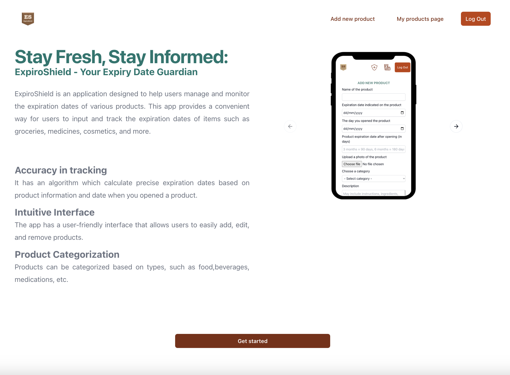

#  ExpiroShield

ExpiroShield is an web application designed to help users manage and monitor the expiration dates of various products. This app provides a convenient way for users to input and track the expiration dates of items such as groceries, medicines, cosmetics, and more.

- **Chronological Timeline:** Displays products in chronological order, highlighting expiration dates from soonest to newest.

- **Advanced Expiry Calculation:** Calculates precise expiration dates based on product details and the opening date.

- **Efficient Product Management:** Easily add, edit, and delete product information. The system automatically generates individual pages for each product, allowing users to upload photos, provide descriptions, select categories, and assign importance.

- **Expiration Status Sections:** Includes an archive for expired products and a "About to Expire" section, providing quick access to products that will expire in the next two weeks. Keep your inventory organized and stay ahead of expirations.

- **Responsive design:** Enjoy seamless usage on any device. The interface adapts to different screen sizes for a user-friendly experience across devices.



## Tech Stack:

**Frontend:** Next.js, React, TypeScript.<br>
**Backend:** Prisma ORM, Express. <br>
**Styling:** Tailwind CSS, Shadcn.

## Getting Started

**1. Clone the Repository:**

```bash
  git clone https://github.com/alenamosk/ExpiroShield
```

**2. Backend Setup:**

- Navigate to the backend directory:

```bash
  cd back
```

- Install dependencies:

```bash
npm install
```

- Configure database:

  - Navigate to the `prisma` folder:

  ```bash
  cd prisma
  ```

  - Seed the database:

  ```bash
  npx tsx seed.ts
  ```

  - Synchronize the database tables with defined schema models:

  ```bash
  npx prisma db push
  ```

  - Inspecting the Database with Prisma Studio:

  ```bash
  npx prisma studio
  ```

- Navigate to the backend directory and run the server:

```bash
  npx tsx watch server.ts
```

**2. Frontend Setup:**

- Navigate to the frontend folder:

```bash
  cd front
```

- Install dependencies:

```bash
npm install
```

- Run the development server:

```bash
npm run dev
```
